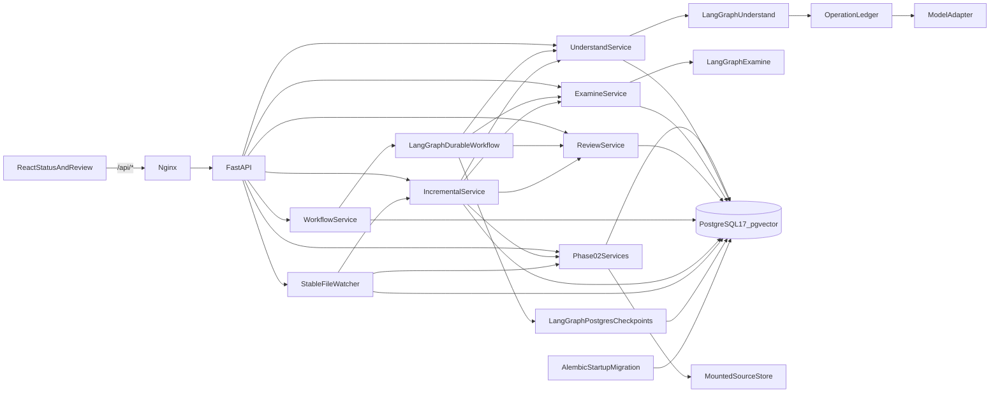
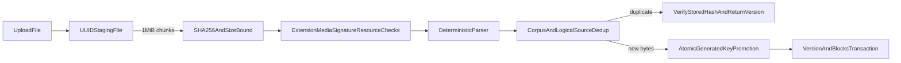
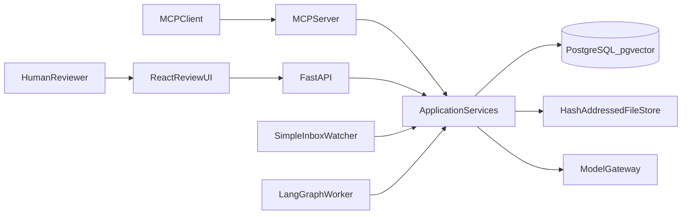
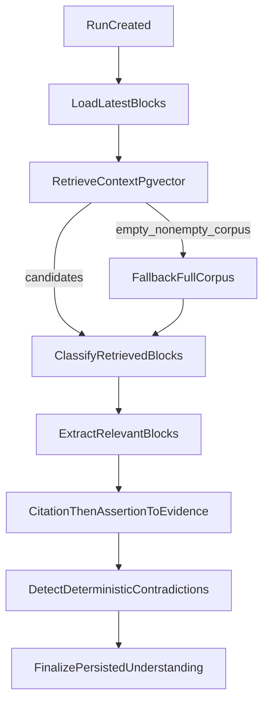
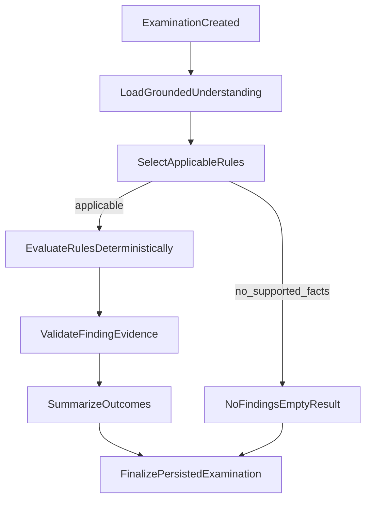
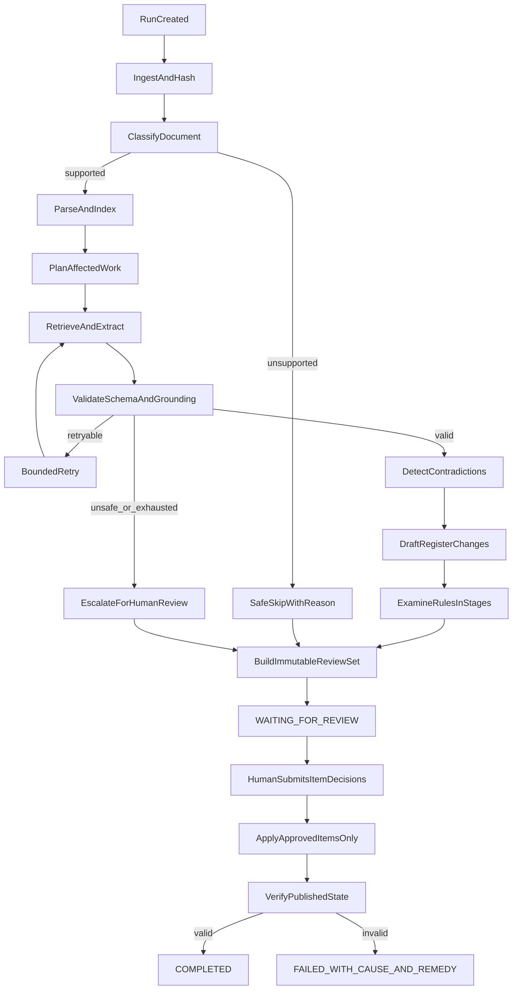

# Proposed Architecture — Project Assurance Register

## Status

**Phase 01 foundation, Phase 02 deterministic ingestion/provenance, Phase 03 Understand, Phase 04
Examine, Phase 05 item-level human review, Phase 06 durable resume, and Phase 07 focused incremental
updates are implemented.** Independent Phase 03 FAIL (grounding) and follow-up NO-GO remain historical
record. Phase 03 current status is independent final follow-up GO: committed, PR #3 merged to `main`
as `ceb2bf0`, remote CI PASS. Phase 04 and Phase 05 independent FAIL / NO-GO remain historical.
Phase 06 initial local implementation PASS; independent verification FAIL / NO-GO; later exclusive
retry-allowlist correction is implemented locally and is not independently re-verified. Phase 07 is
a local implementation PASS and is not independently re-verified. Examine consumes grounded
Phase 03 records and revalidates
Phase 02 provenance before persisting definitive findings. Human review creates an explicit
`WAITING_FOR_REVIEW` session from a completed examination and records item-level approve/reject/edit
decisions without publishing a register. Durable workflow runs coordinate those stages with
PostgreSQL LangGraph checkpoints, a session-level same-run execution lock, an operation ledger, and
process-kill resume. Incremental runs detect SHA-256 source-version changes against a durable
corpus revision, recompute only provenance-affected work, reuse unaffected artifacts with canonical
unchanged-byte proof, and persist executed-versus-reused operation evidence.

MCP business tools, register publication, and production deployment remain planned. Implementation
evidence may simplify or revise those plans; revisions are recorded in `PROGRESS.md`.

## Design goals

The architecture exists to prove:

- the understand, examine, and stay-alive movements;
- visible stages with real retry, skip, and human-escalation branches;
- durable resume after process death;
- a real item-level human gate;
- complete machine operation with explicit gate operations;
- exact source provenance and no bluffing;
- focused incremental updates and exact unchanged-content proof;
- idempotency, concurrent-run isolation, and safe publication; and
- keyless executable evidence.

It does not exist to demonstrate infrastructure breadth.

The explicit non-cuttable floor is limited to behaviors 1–5: visible path-changing stages, durable resume, item-level human review, machine-driven flow, and no-bluffing. Understand, examine, and stay alive must each remain genuinely represented, but detailed sub-features inside the movements may be cut with explicit rationale.

One-command stranger setup, real keyless tests, document prompt-injection defense, concurrent isolation, and stage timing/cost are behaviors 6–10. Each is a **Strong differentiator — may be cut only with explicit rationale if time forces a trade-off.** Phase 06 implements same-corpus workflow-run isolation, keyless kill/resume proof, and raw run-event timing/cost fields. Phase 07 implements focused incremental stay-alive with executable no-full-rerun proof. Concurrent publication, MCP, and one-command stranger-setup polish remain later.

## Stack classification

Assignment requested/preferred:

- Python with FastAPI;
- an orchestration framework such as LangGraph or LangChain;
- PostgreSQL with vector search; and
- React.

The assignment allows comparable orchestration/tools when justified.

Our chosen implementation is Python, FastAPI, LangGraph, PostgreSQL with pgvector, React with TypeScript, and MCP. MCP is the strongest chosen machine-interface shape, not an absolute assignment mandate.

## Implemented Phase 01–07 runtime

The current runtime boundary is deliberately small:



- Nginx serves immutable Vite production assets and proxies `/api/*` to FastAPI.
- FastAPI owns liveness/readiness/version plus corpus, source, citation, retrieval, Understand
  analysis-run, Examine examination-run, human-review, durable workflow-run, corpus-revision, and
  incremental-run routes. `POST /watcher/poll` is available when `WATCH_INPUT_PATH` is set.
- `/health` has no database dependency.
- `/ready` performs a bounded PostgreSQL connection check and verifies `pg_extension` contains
  `vector`; safe structured HTTP 503 output is returned otherwise.
- SQLAlchemy creates an async engine/session factory during application lifespan.
- Alembic revision `20260819_0001` enables `vector`; `20260819_0002` creates corpus/source tables;
  `20260819_0003` creates `analysis_runs`, `facts`, `contradictions`, and `stage_events`;
  `20260819_0004` creates `examination_runs`, `findings`, and `examination_stage_events`;
  `20260819_0005` creates `review_sessions`, `review_items`, and `review_decisions`;
  `20260819_0006` creates `workflow_runs`, `durable_operations`, `workflow_run_events`, and
  LangGraph checkpoint tables; `20260819_0007` creates `corpus_revisions`, `incremental_runs`,
  `incremental_artifact_evidence`, and `watcher_files`.
- Compose orders startup by health: database, migrating backend, then frontend.
- Default `MODEL_PROVIDER=deterministic` requires no API key. The single live provider is
  OpenAI-compatible chat completions, selected only by environment.
- LangGraph executes Understand and Examine stages with real conditional skips. The outer durable
  graph uses `AsyncPostgresSaver` with `durability="sync"`. Human review uses `interrupt()` and
  remains `waiting_for_review` until Phase 05 completion. MCP remains locked but unused.

## Implemented Phase 02 data layer

### Records and constraints

- `Corpus` is the isolation and declared-format boundary.
- `Source` is unique by `(corpus_id, logical_name)`.
- `SourceVersion` is unique by `(source_id, sha256)`, has a globally unique generated storage key,
  and redundantly carries `corpus_id` under a composite source/corpus foreign key.
- `SourceBlock` is unique by version/block index and version/native locator and carries a composite
  version/corpus foreign key.
- Version and block mutation endpoints do not exist. Changed bytes create another version; exact
  duplicate bytes for one logical source return the existing version.
- `SourceVersion` and `SourceBlock` are immutable by application contract and API/service behavior.
  Database UPDATE/DELETE prevention triggers and restricted mutation roles are not implemented.
- No Fact, Contradiction, Finding, Rule, ChangeSet, ReviewDecision, RegisterVersion, run, or
  checkpoint business table was created.

### Ingestion/storage transaction



The default maximum upload is 10 MiB. A request-level Content-Length guard allows 1 MiB for
multipart overhead before normal multipart processing, while the streamed file-content bound
remains authoritative. Missing/chunked Content-Length cannot be rejected by the first guard and
relies on streaming enforcement.

Keys use only UUIDs, SHA-256, and a server-selected extension:
`corpus/source/hash-prefix/hash/version.ext`. Client filenames are metadata only and filenames with
path separators, drive separators, or traversal components are rejected. In-process failures
attempt staged/promoted-file cleanup.

A crash after promotion but before database commit can leave an orphan. Cancellation edges require
later reconciliation, and cleanup failures are best-effort. Transactional outbox/object-store
reconciliation remains deferred with durable workflow recovery.

DOCX ZIP validation bounds entry count (1,000), each expanded entry (20 MiB), total expanded size
(50 MiB), and compression ratio (200:1). PDF parsing is text-only; no extractable blocks produces a
typed `textless_pdf` failure and no OCR fallback.

### Parser locator/normalization contract

- PDF: `page[n]/block[n]`, where page number is one-based and parser block index is zero-based.
- DOCX: `paragraph[n]` or
  `table[n]/row[n]/cell[n]/paragraph[n]`, all deterministic document-order indexes.
- Markdown/TXT: `lines[start-end]/block[n]`, with one-based inclusive source line ranges.

Normalized block text uses LF line endings, Unicode NFC, regular spaces for NBSP, removed trailing
whitespace on each line, and removed blank boundary lines. Interior line structure is retained.
`normalized_start` is zero for a stored block and `normalized_end` is its PostgreSQL/Python
character length. Citation spans are half-open offsets within that block.

### Exact citation resolution

Resolution order is source-version lookup scoped by corpus, source-file SHA-256 recalculation,
citation SHA/format comparison, deterministic fresh parsing of the original bytes, native-locator
lookup in that fresh parse, persisted-block integrity comparison, fresh span bounds check, and exact
quote comparison. Source bytes are re-hashed after parsing to reduce the hash/parse race window.
Missing/cross-corpus versions are not found. Persisted block text or a vector result cannot bypass
this resolver.

### Deterministic pgvector retrieval

Source text tokens are case-folded and SHA-256 feature-hashed into 64 signed dimensions, then
L2-normalized. PostgreSQL stores the vector and performs cosine-distance ordering under corpus plus
optional format/block-type filters. Zero-token queries are rejected. This is deterministic lexical
retrieval support for local tests, not a model gateway or semantic embedding claim.

## Planned system shape

Use one modular application codebase with a small number of process roles:



The API, worker, watcher, and MCP server are process roles from the same codebase and share application services and storage rules. They are not independent microservices.

Hosted deployment is not explicitly required by Task 1. Our minimum acceptance target is a reproducible local/container deployment. Hosted deployment will be attempted only after all mandatory Task 1 behaviors and evidence are green.

## Component responsibilities

### FastAPI

Implemented now:

- stream bounded uploads to durable file storage;
- create/inspect corpora, logical sources, immutable versions, and blocks;
- validate exact citations and run corpus-scoped deterministic retrieval;
- create and inspect Understand analysis runs, facts, contradictions, and stage events;
- create and inspect Examine runs, findings, summaries, and stage events;
- create and inspect review sessions, enumerate review items with grounded evidence, record
  explicit item-level approve/reject/edit decisions under row-level transactional locking, and
  complete a session only after required items have terminal decisions;
- start, inspect, and resume corpus-scoped durable workflow runs, including event listing.

Later planned responsibilities:

- publish approved-only register versions;
- serve immutable source snippets/locators safely.

### LangGraph Understand workflow

Implemented in-process for Phase 03 (the inner Understand graph is not itself PostgreSQL-checkpointed;
Phase 06 checkpoints the outer durable workflow around it):



Skipped conceptual stages still persist `StageEvent` rows (`empty_corpus`, `no_relevant_blocks`,
`retrieval_empty_fallback`, `prior_stage_failed`).

- Retrieval selects candidate context and records block IDs. Classification runs only on those
  candidates. Empty retrieval on a non-empty corpus records `retrieval_mode=fallback_full_corpus`
  and classifies a bounded full-corpus set. Retrieval is not evidence.
- Classification does not default every block to relevant. Injection-like source text is forced to
  `untrusted_instruction` / not relevant after the model returns, excluded from extraction, and
  rejected if a provider still proposes a fact from it.
- Every supported fact must pass the Phase 02 citation resolver **and** a deterministic
  assertion-to-evidence check against the freshly resolved quote (category, subject_key,
  normalized_value, and source_block_id). Vector similarity is not evidence.
- Unknown configured inspection fields become `unknown` / `INSUFFICIENT_EVIDENCE`.
- Contradictions are emitted only for the same category and subject key with incompatible values,
  using canonical fact-id ordering within the same run and corpus.
- Canonical stages are always inspectable. Skipped stages persist `status=skipped` with a reason
  (`empty_corpus`, `no_relevant_blocks`, `retrieval_empty_fallback`, `prior_stage_failed`),
  `model_operation_count=0`, and `estimated_cost_usd=0`. `model_operation_count` is logical;
  `model_attempt_count` is provider HTTP attempts.

Phase 06 durable kill/resume and human-review interrupt are implemented on the outer workflow graph.

### LangGraph Examine workflow

Implemented in-process for Phase 04 (the inner Examine graph is not itself PostgreSQL-checkpointed;
Phase 06 checkpoints the outer durable workflow around it):



- Examine loads Phase 03 facts and contradictions only. It does not re-extract, re-classify, or
  treat pgvector hits as evidence.
- Subject-specific rules match both the rule's category and `subject_key`. A contradiction matches
  such a rule only when both grounded fact sides satisfy that category and subject.
- Ruleset `software-project-assurance.v1` is central versioned data plus named evaluators. Document
  text cannot add, remove, or override a rule.
- A rule applies only when the analysis run contains at least one supported fact. Otherwise the
  applicable-rule count is zero and the run is an explicit `no_findings` result.
- PASS, FAIL, and WARNING findings that use grounded-fact evidence must cite supported facts (and
  contradictions when used). `spa.contradiction.open` may PASS with a deterministic
  `detect_contradictions` completed attestation when no unconsumed contradictions remain; that is
  process evidence, not source provenance, and attaches no facts. UNKNOWN explains the missing
  required evidence and must not claim citations, facts, or contradictions.
- Before a definitive finding is persisted, Examine reloads the same-run fact, reruns the Phase 02
  exact citation resolver against original bytes, and reruns Phase 03 assertion grounding. Persisted
  citation JSON is not trusted merely because it is well-formed.
- Canonical stages are always inspectable. `rule_evaluation_count` is recorded only on
  `evaluate_rules`. Deterministic Examine records zero model operations and
  `cost_basis=zero_deterministic`.

### PostgreSQL with pgvector

Implemented now: corpus/source/version/block metadata, analysis runs, facts, contradictions, stage
events, examination runs, findings, finding fact evidence, finding contradiction evidence,
examination stage events, composite corpus constraints, fact-to-source-block corpus FK,
supported-fact provenance check, contradiction run/corpus composite FKs with canonical pair
uniqueness, examination-run analysis-run/corpus composite FK, finding outcome/evidence-kind checks,
finding-to-fact and finding-to-contradiction composite FKs that reject cross-run and cross-corpus
evidence, deterministic vectors, HNSW indexing, and metadata-filtered retrieval.

Later planned responsibilities:

- published register versions and item hashes; and
- append-only change-attribution events.

Implemented in Phase 06: LangGraph checkpoint tables, durable workflow runs, operation ledger
keys/results, and run events.

pgvector assists retrieval recall. It is not evidence and cannot satisfy provenance.

### Hash-addressed file store

The implemented local/container adapter streams originals outside process memory, incorporates
SHA-256 into generated version keys, uses a mounted named volume, and re-reads/reparses bytes for
citation validation. Normalized blocks are stored in PostgreSQL rather than as duplicate filesystem
artifacts. Object storage is not required for the acceptance target.

### React review UI

Phase 05 implements a minimal review panel in the existing React/TypeScript shell:

- open or reuse a review session from corpus and examination-run identifiers;
- list review items with outcome, severity, reason, and grounded citations;
- show pending/approved/rejected/edited state and session counts;
- submit explicit APPROVE, REJECT, and confirmed reviewer-authored EDIT, sending
  `reviewer_authored_acknowledged=true` for edits;
- disable completion until every required item has a terminal decision;
- loading, error, and pending-request states without stack traces.

Rich document editing, stage timelines, and observability dashboards remain later.

### Simple watched inbox

Implemented as stable-file polling of a mounted inbox. Contract:

- Path: `{WATCH_INPUT_PATH}/{corpus_id}/{logical_name}.{ext}`
- Eligibility: identical SHA-256 and byte size across `WATCH_STABLE_POLLS` consecutive polls
- Identity: content hash, not filesystem mtime
- Duplicate unchanged bytes after `completed`/`unchanged` do not retrigger
- Restart uses persisted `watcher_files` rows
- Partial/in-progress writes reset the stability counter
- Ingest without a successful incremental run stays `ingested_incremental_pending` or
  `failed_retryable` and retries incremental on the same SHA-256 without a new SourceVersion
- Terminal malformed files stay `failed_terminal` until bytes change
- Temporary disappearance of an ingested/unchanged/completed file is recorded as `missing`;
  SourceVersion rows are not deleted
- Upload safety: generated storage keys, extension/type validation, content bounds, traversal
  rejection, no source-content logging

A sophisticated event system (watchdog, inotify, Kafka, Celery, Redis) is not used.

### Chosen MCP server

Planned as a thin adapter over the same application services as FastAPI:

- create/upload/configure a corpus and run;
- inspect status and stage decisions;
- retrieve pending item-level review proposals;
- submit explicit approve/reject decisions;
- resume the interrupted graph; and
- verify the resulting published register and audit history.

MCP exposes the gate but does not bypass it. The demonstrated path must not let the proposing agent automatically approve its own proposals. This is a workflow requirement, not an added RBAC or proposer/reviewer identity-separation requirement.

## Core records

Implemented in Phase 02:

- `Corpus`: isolation boundary and declared domain/format policy.
- `Source`: logical document identity.
- `SourceVersion`: immutable content hash, storage key, parser status, and arrival time.
- `SourceBlock`: format-native locator, normalized text/span, metadata, and required deterministic
  embedding.

Implemented in Phase 03:

- `AnalysisRun`: corpus-scoped Understand execution, provider mode, taxonomy/graph versions,
  status, error, and inspectable result payload.
- `Fact`: typed assertion with support status, optional exact citation, and source block id.
- `Contradiction`: incompatible supported facts with both sides cited.
- `StageEvent`: stage name, timing, model operation count, token/cost fields, and failure state.

Implemented in Phase 04:

- `ExaminationRun`: corpus-scoped Examine execution bound to one analysis run, ruleset/graph
  versions, outcome counts, status, error, and inspectable result payload.
- `Finding`: one rule evaluation with outcome, severity, structured reason, fact/contradiction
  references, and copied Phase 02 citations.
- `ExaminationStageEvent`: Examine stage name, timing, rule-evaluation count, zero deterministic
  cost, skip reason, and failure state.

Implemented in Phase 05:

- `ReviewSession`: corpus-scoped review over one completed examination run. Status is
  `waiting_for_review` until an explicit complete call. One session per examination. Counts cover
  required pending plus approved/rejected/edited totals. Session creation never implies approval.
- `ReviewItem`: one finding snapshot with review-required mapping (FAIL/WARNING/UNKNOWN required;
  PASS optional), original proposed content, current status, and optional reviewer-authored edit.
- `ReviewDecision`: append-only approve/reject/edit record with previous/new status, original
  proposal snapshot, edited content when applicable, explicit reviewer-authored acknowledgement,
  actor/source, comment, and timestamp. Decision writes lock the session then the item.

Implemented in Phase 06:

- `WorkflowRun`: corpus-scoped durable orchestration over Understand, Examine, and the human-review
  gate. Status is `pending`, `running`, `waiting_for_review`, `failed`, or `completed`. Current
  stage, attempt/resume counts, checkpoint thread id (equal to run id), linked analysis/
  examination/review ids, configuration/version identifiers, and failure cause/remedy are stored.
  Failed is not waiting.
- `DurableOperation`: idempotency ledger row keyed by SHA-256 of the canonical identity payload:
  workflow run id, stage, operation type, source-input version, canonical request hash, model
  provider, model name, taxonomy version, Understand graph/version, prompt/config version, and outer
  workflow graph version. Timestamps are excluded. Status is `intended`, `in_flight`, `completed`,
  `failed`, or `ambiguous`. Records logical operation count, provider attempts, result hash/payload,
  and provider idempotency identifier. CHECK constraints reject invalid lifecycle combinations.
- `WorkflowRunEvent`: append-only stage/resume/failure/checkpoint evidence for one run.

Implemented in Phase 07:

- `CorpusRevision`: durable incremental baseline/current snapshot for one corpus. Stores revision
  number, `is_current` (one current row per corpus), linked analysis/examination/review identifiers,
  a JSON source-version snapshot for API convenience, and taxonomy/graph/prompt/ruleset/examine
  versions. Authoritative membership is `corpus_revision_sources`. PostgreSQL enforces the chain
revision → corpus → source → source version → exact SHA-256: membership rows FK to
`(source_version_id, source_id, corpus_id, sha256)` against `source_versions`
`(id, source_id, corpus_id, sha256)`. The recorded SHA is not free-standing authority.
Advancing N to N+1 flips `is_current`, writes membership, and completes
the incremental run in one transaction. A crash after Understand/Examine/review rows are
written but before that finalization transaction may leave non-current orphan
`AnalysisRun`, `ExaminationRun`, and `ReviewSession` rows. They cannot become current
revision state, are not reused as the authoritative baseline, are not deleted automatically,
and cleanup/reconciliation is deferred.
- `IncrementalRun`: one incremental execution against a recorded baseline revision. Status is
  `pending`, `running`, `completed`, `failed`, or `stale_baseline`. Change kind is
  `unchanged`, `changed`, `added`, `removed`, `mixed`, or `stale_baseline`. Impact, evidence, and
  measurement JSONB persist executed-versus-reused IDs, durable operation keys, canonical
  unchanged-artifact hashes from persisted rows, stages executed/skipped from actual control flow,
  and raw stage/model counts. Completed requires `completed_at`; stale does not.
- `IncrementalArtifactEvidence`: per-artifact disposition (`reused`, `recomputed`, `added`,
  `removed`, `executed`, `skipped`, `unchanged`, `obsolete`) with canonical hashes before/after
  and optional `durable_operation_id` for ledger-backed operation reuse.
- `DurableOperation.workflow_run_id` is nullable from Phase 07 so content-keyed classify/extract
  rows can belong to an incremental run instead of a workflow run. Reuse is claimed only when a
  completed ledger row with that content identity exists. Downgrade `20260819_0007` →
  `20260819_0006` deletes incremental-owned ledger rows (`incremental_run_id IS NOT NULL` or
  `workflow_run_id IS NULL`) and drops watcher/evidence/incremental-run tables **before** restoring
  `workflow_run_id` NOT NULL. Workflow-owned ledger rows remain. Phase 07 revision/run/evidence
  data is discarded by that downgrade; that is the reverse of the upgrade, not a data-preserving
  rollback.
- `WatcherFile`: unique `(inbox_root, relative_path)` poller state. Status is `observing`,
  `stable`, `ingested_incremental_pending`, `processing_incremental`, `completed`,
  `failed_retryable`, `failed_terminal`, `unchanged`, or `missing`. Restart uses these rows so
  unchanged completed bytes are not re-ingested, while pending incremental work is retried.

LangGraph checkpoint tables (`checkpoints`, `checkpoint_blobs`, `checkpoint_writes`,
`checkpoint_migrations`) are created by migration `20260819_0006` and owned by
`AsyncPostgresSaver`.

Rules live in versioned application configuration (`software-project-assurance.v1`), not a
user-upload table. A user-supplied rule editor is not implemented.

Planned for later phases:

- `RegisterItem`: stable assurance item with canonical serialized content.
- `ChangeSet` and `ChangeItem`: immutable proposals and their before/after hashes.
- `RegisterVersion`: published version and ordered item hashes.

Every query and uniqueness rule must include the appropriate corpus, source, run, or register-version identity. Do not rely on process-local global state.

## Planned agent graph



Visible stage events must record the selected branch and reason. Retry is bounded. Skip must state the unsupported input and remedy. Escalation creates a review item rather than silently continuing.

## Human gate state machine

The implemented Phase 05 path is:

```text
completed examination
→ create immutable review session (WAITING_FOR_REVIEW)
→ human or machine inspects each item and its grounded evidence
→ explicit approve / reject / edit per item
→ SELECT session FOR UPDATE; decisions also lock the target item
→ append-only decision history; latest valid state is current
→ recompute session counts from item rows in the same transaction
→ complete only when every required item has a terminal decision
```

The implemented Phase 06 resume path is:

```text
POST /workflow-runs
→ durable Understand / Examine / open_review
→ status = waiting_for_review; LangGraph interrupt()
→ process restart or POST .../resume
→ still waiting_for_review; no decisions created
→ explicit Phase 05 complete
→ resume continues to finalize
→ workflow status = completed (no publication)
```

Register publication remains later:

```text
READY_TO_RESUME
→ APPLYING_APPROVED_ITEMS
→ VERIFYING
→ COMPLETED
```

Rules:

- A proposal set is immutable once presented (`proposal_set_version`).
- Review-required items are FAIL, WARNING, and UNKNOWN findings. PASS items are visible and optional.
- Generation never auto-approves. Pending required items block completion.
- Mixed approval/rejection/edit is allowed. Rejecting one item does not discard sibling decisions.
- Edited reviewer text is marked reviewer-authored and is not treated as system-grounded evidence.
- Phase 03/04 records are not mutated by review.
- React and API use the same decision validation. MCP is not implemented.
- Publication of approved-only register versions is not implemented.

## Exact provenance

The implemented source citation is:

```text
source_version_id
source_sha256
format
native_locator
normalized_start
normalized_end
exact_quote
```

Examples of native locators:

- PDF: page plus parser block index;
- DOCX: paragraph or table/row/cell path;
- Markdown/TXT: line range plus block index.

The source version and normalized parser artifact are immutable by application contract. The
Phase 02 resolver confirms stored bytes still hash correctly, reparses them, and checks that the
fresh locator/span yields the exact quote and matches persisted block content. Later publication
code must call this same deterministic boundary; a model cannot override it.

For a finding grounded against the generated register/deliverable, the planned locator is:

```text
register_version_id
register_item_id
field_path
value_hash
exact_value
```

The register version is immutable. Before a deliverable-grounded finding is treated as supported, a deterministic validator resolves the item and field path, confirms the exact value, and verifies its hash.

## Understand movement

Implemented stages:

1. load latest source versions for the corpus;
2. retrieve candidate blocks with taxonomy queries through pgvector (context only);
3. classify **only retrieved candidates** (or a recorded bounded full-corpus fallback);
4. extract atomic facts from classified-relevant blocks through the model boundary;
5. validate every proposed citation with the Phase 02 resolver, then run deterministic
   assertion-to-evidence validation on the resolved quote;
6. emit configured inspection fields as UNKNOWN / INSUFFICIENT_EVIDENCE when unsupported;
7. detect contradictions only among supported facts that share category and subject key; and
8. persist an inspectable run with facts, contradictions, rejections, skipped-stage events, and
   retrieval mode.

Taxonomy `software-project-assurance.v1` is configuration, not corpus-name logic. Categories include
project identity, owner/accountability, milestone/date, status, risk, decision, dependency, and
control/assurance. Document prompt-injection text is untrusted evidence.

Register drafting and human review remain later phases.

## Examine movement

Implemented stages:

1. load the completed same-corpus Understand run, supported facts, unknown inspection fields, and
   grounded contradictions;
2. select the versioned ruleset when supported evidence exists; otherwise record an explicit
   no-findings result after a zero applicable-rule count;
3. evaluate each selected rule with a named deterministic evaluator;
4. validate that PASS/FAIL/WARNING grounded-fact findings reference supported facts from the same
   analysis run and corpus, revalidate those facts through the Phase 02 exact citation resolver and
   Phase 03 assertion-to-evidence check, that contradiction findings revalidate both sides, and that
   UNKNOWN findings do not claim evidence. Process-attestation PASS is allowed only for completed
   same-run `detect_contradictions` with zero remaining unconsumed contradictions and no attached
   facts;
5. summarize pass/fail/warning/unknown counts without double-counting a contradiction already
   consumed by a more specific rule; and
6. persist an inspectable examination run with FK-backed fact and contradiction evidence. API
   citations are derived from those referenced facts.

Ruleset `software-project-assurance.v1` covers ownership, status clarity, production-readiness
consistency, security-signoff assignment, budget ownership, dependency evidence, control/assurance
evidence, and remaining open contradictions. Evaluators consume Phase 03 records only.

Examine evidence is one of:

- **source evidence** — Phase 02 exact provenance over original bytes. Examine never treats copied
  citation JSON as the authoritative relationship.
- **grounded fact evidence** — FK references to same-run/same-corpus Phase 03 SUPPORTED facts and
  contradictions. API citations are derived from those facts after revalidation.
- **deterministic analysis-stage attestation** — same-run/same-corpus completed
  `detect_contradictions` stage proving contradiction detection finished. This is process evidence,
  not source provenance.

Outcomes:

- `pass` — required supported evidence is present and satisfies the rule, or contradiction
  detection is attested complete with no remaining unconsumed contradictions;
- `fail` — grounded conflicting values, a remaining open contradiction, or an explicit unassigned
  owner;
- `warning` — grounded degraded status (amber) that is not a hard failure;
- `unknown` — required supported evidence is absent. Silence is not compliance. UNKNOWN carries no
  fabricated evidence.

A skipped or failed examination is never reported as no findings. Register-state examination is
not implemented because no published register exists yet.

## Incremental stay-alive movement

Phase 07 implements focused incremental updates over an already processed corpus. Register
publication is not part of this phase.

Change identity is logical source plus SHA-256. Timestamps are not used. UNCHANGED identical bytes
reuse the existing SourceVersion. CHANGED bytes create a new immutable SourceVersion. ADDED is a
new logical source. REMOVED is planned when a logical source disappears from the latest version
set; the watcher records temporarily missing inbox files and does not delete Source/SourceVersion
rows.

Impact uses explicit provenance, not vector similarity and not corpus-name special cases:

- a fact citing a changed/retired source version is affected;
- a contradiction referencing an affected fact is affected;
- a finding/rule whose required category/subject inputs may have changed is affected;
- `spa.contradiction.open` is treated as corpus-wide remaining-contradiction state and is rerun
  when contradictions change or a source is new/changed.

Unaffected supported facts are copied into a new AnalysisRun with new row ids and identical
canonical business payloads. Unrelated contradictions and rule findings are remapped similarly.
Changed/new source versions are classified and extracted only. Unchanged sources are recorded as
skipped classify/extract source-version IDs. A new ExaminationRun and a new ReviewSession are
created. The previous review session remains immutable. New items start pending. Prior approvals
are never copied. Byte-identical review proposals are labelled `reused` only after independently serializing
persisted baseline and incremental `ReviewItem` + Finding/evidence rows with
`incremental-artifact.v1`. Canonical review identity includes rule id/version, outcome,
severity, title, message, structured_reason, evidence_kind, canonical fact and contradiction
identities, citation/source-version identity, and `review_required`. It excludes
`review_session_id`, `review_item_id`, timestamps, and current decision state. Differing
canonical bytes cannot be labelled reused. Materially changed proposals require fresh explicit
review. Unchanged reusable
artifacts must have identical canonical hashes before and after reuse. Hash equality proves
preservation; executed-versus-skipped classify **and** extract source versions, reused-versus-recomputed artifact IDs,
content operation keys, and stages executed/skipped prove that a full Understand rerun was avoided.

A crash after incremental Understand/Examine/review rows are written but before atomic revision
finalization may leave non-current orphan `AnalysisRun`, `ExaminationRun`, and `ReviewSession`
rows. They cannot become current revision state, are not reused as the authoritative baseline,
are not deleted automatically, and cleanup/reconciliation is deferred.

Same-corpus incremental execution is serialized with
`pg_advisory_lock(hashtext('incremental-corpus:{corpus_id}'))`. An explicit baseline that is not
current persists `stale_baseline` and does not apply a mixed-base result. The API maps that status
to HTTP 409.

Incremental content operation keys omit workflow run id and incorporate source-input versions plus
taxonomy/graph/prompt versions. Changed immutable source input yields a distinct key. Phase 06
workflow keys are unchanged.

Deterministic mode records `estimated_cost_usd = 0`. Measurement persists baseline versus
incremental stage counts, avoided model-operation count (unchanged sources skipped), affected/
reused artifact counts, changed-source count, and duration. Cost savings are not fabricated.

## Durability, idempotency, and concurrency

Durable resume is non-cuttable behavior 2 and is implemented in Phase 06. Concurrent-run isolation
for independent workflow runs against the same corpus is implemented. Concurrent publication of a
register version remains planned behavior 9 remainder: **Strong differentiator — may be cut only
with explicit rationale if time forces a trade-off.** Publication is not implemented in Phase 06
because the durable contract stops at the explicit human-review gate.

Implemented PostgreSQL-backed mechanism:

- Outer LangGraph graph: `understand → after_understand → examine → after_examine → open_review →
  wait_for_review → finalize`, compiled with `AsyncPostgresSaver` and `durability="sync"`.
- `checkpoint_thread_id` is the workflow run UUID. Checkpoints are not in-memory for Phase 06
  evidence.
- Same-run graph execution is serialized by a dedicated PostgreSQL session-level advisory lock
  (`pg_advisory_lock(hashtext('workflow-run:{run_id}'))`) on a connection kept open for the whole
  critical window: claim → re-read run → inspect checkpoint → optional failed-thread reset → graph
  invoke/resume → final workflow state read/update → unlock. `SELECT ... FOR UPDATE` is only the
  short claim transaction inside that window. Process-local mutexes are not used.
- `resume_count` increments once per actual start/resume execution after that lock is held. Two
  concurrent callers do not both increment unless both actually execute after serializing.
- Costly model calls persist attempt intent (`in_flight` with `provider_attempt_count` incremented)
  and commit it before each ledger-invoked provider function. Completed keys reuse the stored
  result (local completed persistence).
- Logical idempotency: `logical_operation_count = 1` for a successful logical operation. Provider
  attempts may exceed one only when a safe retry policy actually initiated those attempts.
- Deterministic adapter retries inside the provider boundary count as one logical operation and
  multiple provider attempts.
- Provider ambiguity: if a prior call may have executed and the local result was not stored, the
  row is `ambiguous`. Deterministic tests may reconcile; the live path requires an explicit retry
  policy. Exactly-once provider execution is not claimed.
- Live retry policy is exclusive. Automatic retries: `ConnectTimeout`, `PoolTimeout`,
  `ConnectError`, HTTP 429, and HTTP 503 only. The live request loop retries solely on an
  explicit `SAFE_RETRY` disposition. Malformed HTTP 200 / invalid structured output is
  `TERMINAL` (`model_output_invalid`) and is not retried. Ambiguous/non-retry: `ReadTimeout`,
  `WriteTimeout`, unknown `TimeoutException`, HTTP 408, HTTP 504, `RemoteProtocolError`, and
  unclassified `httpx.HTTPError`. Uncertain classification becomes `operation_ambiguous`.
- Same-corpus concurrent workflow runs use distinct run/thread ids. Operation keys include
  `workflow_run_id`, so they cannot collide across runs. Concurrent duplicate requests for one key
  are serialized with a session-level `pg_advisory_lock`.
- Same-corpus incremental runs are serialized with
  `pg_advisory_lock(hashtext('incremental-corpus:{corpus_id}'))`. At most one run advances the
  current `CorpusRevision` from N to N+1. A stale explicit baseline is persisted as
  `stale_baseline` and is not applied.
- `wait_for_review` calls `interrupt()`. Resume sends `Command(resume=...)` only when interrupts
  exist **and** the Phase 05 review session is completed. A resume while required items are still
  pending re-reads durable state and stays `waiting_for_review`; it does not auto-approve, create
  decisions, or consume the follow-up interrupt. After explicit Phase 05 completion, resume
  continues to `finalize` / `completed`. Publication is not performed.
- A pending/running run with no checkpoint re-enters the same run/thread from canonical initial
  state. It does not create a new run or thread.
- A raised failed stage leaves LangGraph ERROR pending writes. Failed resume, under the same-run
  session lock, deletes only that thread's checkpoints and restarts the same run/thread from
  durable business/ledger state. This is not in-place node continuation. Completed stages skip from
  durable rows and completed ledger results. Concurrent failed resumes serialize so only one reset
  runs.

Required behavior 2 evidence:

- kill a real worker subprocess after the Understand checkpoint barrier
  (`scripts/durable_workflow_worker.py` + `tests/test_process_kill_resume.py`);
- start a new process;
- resume the same run/thread;
- prove Understand was not repeated and logical operation count is unchanged;
- reach `waiting_for_review` with zero review decisions created.

Implemented same-corpus concurrency evidence (not publication):

- two independent workflow runs against one corpus remain isolated;
- checkpoints and operation keys do not cross;
- concurrent duplicate ledger requests produce one durable logical operation.

A transactional outbox is deliberately not part of the initial commitment.

## Trust boundaries and prompt-injection defense

Document prompt-injection defense is behavior 8. Phase 03 implements the Understand-level
treatment: source text is wrapped as untrusted evidence, cannot redefine system behavior, cannot
disable provenance, and cannot mark the project compliant. Phase 04 extends this: injection text
cannot become an examination rule or override evaluator behavior. Full tool-call/self-approval
defense remains later because those operations do not exist yet.

Trust order:

1. system policy and deterministic validators;
2. explicit real-human decisions submitted through the review operation;
3. versioned examination ruleset configuration;
4. application metadata; and
5. untrusted document text.

Document content is wrapped and labeled as quoted evidence. It cannot:

- replace system policy;
- alter graph transitions directly;
- invoke tools;
- read environment secrets;
- mark itself supported without a valid locator;
- approve a proposal; or
- suppress a contradiction/finding.

An adversarial document must be retained and cited as data while producing no unauthorized action.

This trust ordering does not require RBAC or proposer/reviewer identity separation for the assignment demonstration.

## No-bluffing and failure semantics

- Supported claims require a valid exact citation **and** a deterministic assertion-to-evidence
  match (category, subject_key, normalized_value, and source_block_id) against the resolved quote.
  A valid-but-unrelated citation is not sufficient.
- Unsupported claims remain explicit and cannot be rendered as sourced facts.
- Contradictory evidence remains visible until a human decision; it is not silently reconciled.
- `COMPLETED` for a published register still requires a durable published version, applied-decision
  audit, and successful provenance/hash verification. That publication step is not implemented.
  Workflow run `completed` means the durable graph finished after an explicit Phase 05 review
  completion; it is not a published register.
- Examination findings that are PASS, FAIL, or WARNING with grounded-fact evidence require supported
  Phase 03 facts whose citations revalidate through Phase 02 exact provenance and Phase 03
  assertion-to-evidence matching. Missing evidence is UNKNOWN. Retrieval hits and unsupported
  assertions cannot satisfy a rule. Process-attestation PASS attaches no source or fact evidence.
- Examination failure is not “no findings.”
- A watcher parse failure is not “no change.”
- Errors expose safe cause/remedy information without source contents or secrets.
- Demonstrated model/dependency failure paths should use a working deterministic fallback, bounded retry, safe skip, or human escalation where that path has been implemented and tested.
- If no safe fallback exists, preserve durable state, expose cause and remedy, remain resumable, and do not falsely report success.
- Phase 06 model failure persists `failed` with a safe code/detail/action, then resume retries the
  failed stage without duplicating completed sibling stages. Deterministic fallback is not claimed
  for live provider outages.

## Observability and cost

Behavior 10 remains a strong differentiator. Phase 03 persists durable `StageEvent` rows and
Phase 04 persists `ExaminationStageEvent` rows with stage name, start/end/duration, skip reason
when skipped, logical `model_operation_count`, provider `model_attempt_count`, rule-evaluation
count only on `evaluate_rules` (zero on other Examine stages), token fields when available, estimated cost or honest
`zero_deterministic` / `unavailable`, and failure state. Phase 06 adds `WorkflowRunEvent` rows for
stage completion/skip/failure, resume count, checkpoint presence, operation-key evidence, and
waiting-for-review. Phase 07 persists incremental measurement JSON: baseline versus incremental
stage counts, classify/extract executed versus skipped source-version IDs, avoided model-operation
count, affected/reused artifact counts, changed-source count, duration, and `estimated_cost_usd=0`
in deterministic mode. No observability UI exists.

## Keyless test architecture

Behavior 7 remains a strong differentiator. Phase 03 implements a keyless deterministic adapter:
a compact rule/regex Software Project Assurance extractor with intentionally limited linguistic
coverage. It is not general-purpose semantic reasoning. The live OpenAI-compatible provider remains
separately configurable. Every provider output still passes citation resolution and
assertion-to-evidence validation. Tests exercise real parsers, the Phase 02 citation validator, the
grounding validator, LangGraph Understand and Examine transitions, PostgreSQL/pgvector, FastAPI,
PostgreSQL LangGraph checkpoints, the operation ledger, a real subprocess kill/resume, focused
incremental Aurora/Harbor second runs, stale-baseline concurrency, and stable-file watcher polling.
MCP transport and register publication remain later.

Fixtures must include:

- grounded agreement;
- a contradiction;
- a missing/unsupported fact;
- a clean rule set with no findings;
- a violated rule;
- a changed rule/domain configuration that changes behavior without code changes;
- document prompt injection;
- a focused later source update; and
- a second different project corpus.

## Security and data handling

- Fixtures and demonstrations use synthetic/public data only.
- Uploads use a Content-Length request guard plus a streamed file-content bound; file type and DOCX
  expansion checks cover the supported/tested cases with cause/remedy errors.
- Parsers currently run in-process without a separate timeout/sandbox; this remains a documented
  local-development limitation.
- Source filenames and parser text are never treated as commands.
- Secrets are environment-injected and redacted from logs/errors.
- Integration `TRUNCATE` is guarded by a fixed disposable database name, a distinct application
  database name, and an explicit destructive-test opt-in.
- Corpus/run IDs scope every read/write.
- Review decisions record a human actor and proposal version.
- Phase 02 source versions/blocks are not overwritten through application APIs/services; database
  mutation-prevention triggers and restricted roles are absent.
- Watcher inbox paths reject traversal, unsupported extensions, empty files, and oversized files.
  Source contents are not logged.
- No certification or guaranteed-redaction claim is made.

## Deliberate exclusions and cut order

Defer or cut optional breadth in this order before reducing prioritized differentiators:

1. UI polish;
2. hosted deployment;
3. CSV;
4. multiple model providers;
5. elaborate observability UI;
6. sophisticated watcher implementation; and
7. extra format breadth.

Never cut the five explicit floor behaviors: visible path-changing stages, durable resume, real item-level human review, machine-driven flow, or no-bluffing. Understand, examine, and stay alive must each remain genuinely represented; detailed sub-features inside them may be cut with explicit rationale.

Behaviors 6–10 remain prioritized. Each is a **Strong differentiator — may be cut only with explicit rationale if time forces a trade-off.**

Explicitly out of scope:

- Kubernetes, Terraform, Kafka, Redis, Celery, and microservices;
- OCR/handwriting in the initial version;
- spreadsheet output/editing;
- live multiplayer editing;
- document-management-system behavior;
- unsupported certifications or guaranteed redaction; and
- Task 2, Task 3, Task 4, and extra-credit implementation.

## Architecture validation gates

This planned architecture becomes documented implementation only as matching evidence passes. The minimum gate is the five-behavior floor plus a genuine representation of all three movements; behaviors 6–10 remain strong-differentiator targets:

1. package/version compatibility and local/container skeleton;
2. exact parser locator round-trips;
3. grounded understand and examine graphs;
4. real human `WAITING_FOR_REVIEW` flow;
5. mandatory kill/resume evidence; concurrent publication remains later;
6. incremental affected-set, executed-versus-reused operations, and unchanged canonical-hash
   evidence (Phase 07 local implementation);
7. UI and MCP/API shared-gate behavior;
8. planned Behavior 7/8/10 adversarial, keyless, and measurement evidence; and
9. planned Behavior 6 fresh-clone local/container audit on a second corpus.

If a behavior 6–10 gate is cut, `PROGRESS.md` and README must record the explicit rationale and limitation rather than treating it as failed minimum acceptance.
