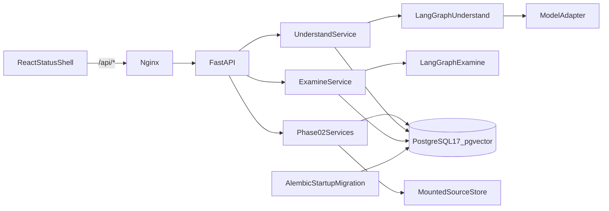
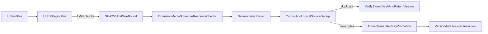
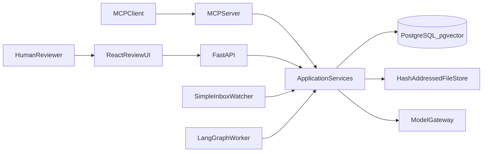
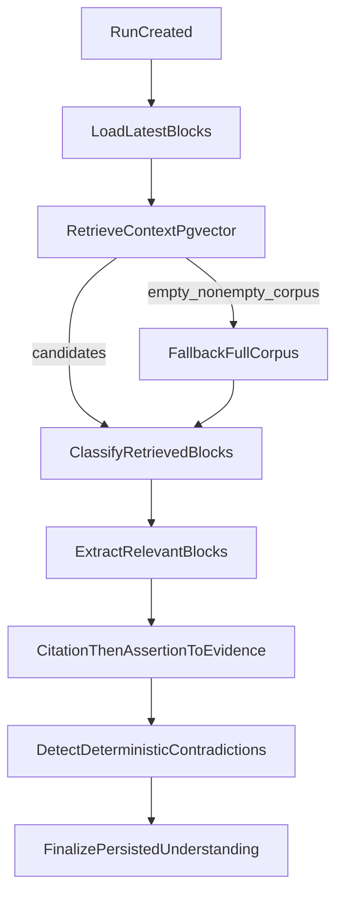
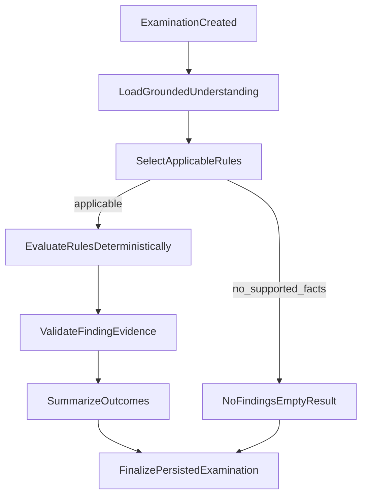
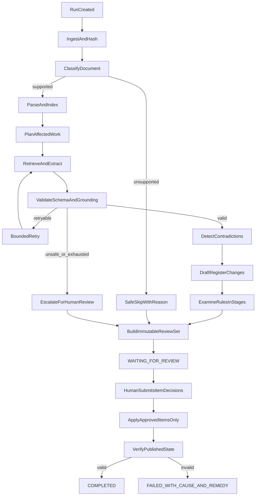

# Proposed Architecture — Project Assurance Register

## Status

**Phase 01 foundation, Phase 02 deterministic ingestion/provenance, Phase 03 Understand, and
Phase 04 Examine are implemented.** Independent Phase 03 FAIL (grounding) and follow-up NO-GO
remain historical record. Phase 03 current status is independent final follow-up GO: committed,
PR #3 merged to `main` as `ceb2bf0`, remote CI PASS. Phase 04 local initial implementation PASS;
independent verification FAIL / NO-GO; correction in progress. Examine consumes grounded Phase 03
records and revalidates Phase 02 provenance before persisting definitive findings.

The executable system now includes corpus-scoped application-immutable source metadata, mounted source-file
storage, streamed hashing, PDF/DOCX/Markdown/TXT parsers, normalized source blocks, exact citation
resolution, deterministic pgvector retrieval, a model boundary with a keyless deterministic adapter,
a LangGraph Understand workflow that persists grounded facts, contradictions, unknowns, and
stage events, and a LangGraph Examine workflow that persists versioned-rule findings and stage
events. Register publication, human review, MCP business tools, durable workflow resume,
incremental updates, and the watcher remain planned. Implementation evidence may simplify or
revise those plans; revisions are recorded in `PROGRESS.md`.

## Design goals

The architecture exists to prove:

- the understand, examine, and stay-alive movements;
- visible stages with real retry, skip, and human-escalation branches;
- durable resume after process death;
- a real item-level human gate;
- complete machine operation with explicit gate operations;
- exact source provenance and no bluffing;
- focused incremental updates and exact unchanged-content proof;
- idempotency, concurrent-run isolation, and safe publication; and
- keyless executable evidence.

It does not exist to demonstrate infrastructure breadth.

The explicit non-cuttable floor is limited to behaviors 1–5: visible path-changing stages, durable resume, item-level human review, machine-driven flow, and no-bluffing. Understand, examine, and stay alive must each remain genuinely represented, but detailed sub-features inside the movements may be cut with explicit rationale.

One-command stranger setup, real keyless tests, document prompt-injection defense, concurrent isolation, and stage timing/cost are behaviors 6–10. Each is a **Strong differentiator — may be cut only with explicit rationale if time forces a trade-off.** They remain planned and prioritized architecture targets, not absolute minimum acceptance gates.

## Stack classification

Assignment requested/preferred:

- Python with FastAPI;
- an orchestration framework such as LangGraph or LangChain;
- PostgreSQL with vector search; and
- React.

The assignment allows comparable orchestration/tools when justified.

Our chosen implementation is Python, FastAPI, LangGraph, PostgreSQL with pgvector, React with TypeScript, and MCP. MCP is the strongest chosen machine-interface shape, not an absolute assignment mandate.

## Implemented Phase 01–04 runtime

The current runtime boundary is deliberately small:



- Nginx serves immutable Vite production assets and proxies `/api/*` to FastAPI.
- FastAPI owns liveness/readiness/version plus corpus, source, citation, retrieval, Understand
  analysis-run, and Examine examination-run routes.
- `/health` has no database dependency.
- `/ready` performs a bounded PostgreSQL connection check and verifies `pg_extension` contains
  `vector`; safe structured HTTP 503 output is returned otherwise.
- SQLAlchemy creates an async engine/session factory during application lifespan.
- Alembic revision `20260819_0001` enables `vector`; `20260819_0002` creates corpus/source tables;
  `20260819_0003` creates `analysis_runs`, `facts`, `contradictions`, and `stage_events`;
  `20260819_0004` creates `examination_runs`, `findings`, and `examination_stage_events`.
- Compose orders startup by health: database, migrating backend, then frontend.
- Default `MODEL_PROVIDER=deterministic` requires no API key. The single live provider is
  OpenAI-compatible chat completions, selected only by environment.
- LangGraph executes Understand and Examine stages with real conditional skips. The PostgreSQL
  checkpointer and MCP remain locked but unused. Human interrupt/resume is not implemented.

## Implemented Phase 02 data layer

### Records and constraints

- `Corpus` is the isolation and declared-format boundary.
- `Source` is unique by `(corpus_id, logical_name)`.
- `SourceVersion` is unique by `(source_id, sha256)`, has a globally unique generated storage key,
  and redundantly carries `corpus_id` under a composite source/corpus foreign key.
- `SourceBlock` is unique by version/block index and version/native locator and carries a composite
  version/corpus foreign key.
- Version and block mutation endpoints do not exist. Changed bytes create another version; exact
  duplicate bytes for one logical source return the existing version.
- `SourceVersion` and `SourceBlock` are immutable by application contract and API/service behavior.
  Database UPDATE/DELETE prevention triggers and restricted mutation roles are not implemented.
- No Fact, Contradiction, Finding, Rule, ChangeSet, ReviewDecision, RegisterVersion, run, or
  checkpoint business table was created.

### Ingestion/storage transaction



The default maximum upload is 10 MiB. A request-level Content-Length guard allows 1 MiB for
multipart overhead before normal multipart processing, while the streamed file-content bound
remains authoritative. Missing/chunked Content-Length cannot be rejected by the first guard and
relies on streaming enforcement.

Keys use only UUIDs, SHA-256, and a server-selected extension:
`corpus/source/hash-prefix/hash/version.ext`. Client filenames are metadata only and filenames with
path separators, drive separators, or traversal components are rejected. In-process failures
attempt staged/promoted-file cleanup.

A crash after promotion but before database commit can leave an orphan. Cancellation edges require
later reconciliation, and cleanup failures are best-effort. Transactional outbox/object-store
reconciliation remains deferred with durable workflow recovery.

DOCX ZIP validation bounds entry count (1,000), each expanded entry (20 MiB), total expanded size
(50 MiB), and compression ratio (200:1). PDF parsing is text-only; no extractable blocks produces a
typed `textless_pdf` failure and no OCR fallback.

### Parser locator/normalization contract

- PDF: `page[n]/block[n]`, where page number is one-based and parser block index is zero-based.
- DOCX: `paragraph[n]` or
  `table[n]/row[n]/cell[n]/paragraph[n]`, all deterministic document-order indexes.
- Markdown/TXT: `lines[start-end]/block[n]`, with one-based inclusive source line ranges.

Normalized block text uses LF line endings, Unicode NFC, regular spaces for NBSP, removed trailing
whitespace on each line, and removed blank boundary lines. Interior line structure is retained.
`normalized_start` is zero for a stored block and `normalized_end` is its PostgreSQL/Python
character length. Citation spans are half-open offsets within that block.

### Exact citation resolution

Resolution order is source-version lookup scoped by corpus, source-file SHA-256 recalculation,
citation SHA/format comparison, deterministic fresh parsing of the original bytes, native-locator
lookup in that fresh parse, persisted-block integrity comparison, fresh span bounds check, and exact
quote comparison. Source bytes are re-hashed after parsing to reduce the hash/parse race window.
Missing/cross-corpus versions are not found. Persisted block text or a vector result cannot bypass
this resolver.

### Deterministic pgvector retrieval

Source text tokens are case-folded and SHA-256 feature-hashed into 64 signed dimensions, then
L2-normalized. PostgreSQL stores the vector and performs cosine-distance ordering under corpus plus
optional format/block-type filters. Zero-token queries are rejected. This is deterministic lexical
retrieval support for local tests, not a model gateway or semantic embedding claim.

## Planned system shape

Use one modular application codebase with a small number of process roles:



The API, worker, watcher, and MCP server are process roles from the same codebase and share application services and storage rules. They are not independent microservices.

Hosted deployment is not explicitly required by Task 1. Our minimum acceptance target is a reproducible local/container deployment. Hosted deployment will be attempted only after all mandatory Task 1 behaviors and evidence are green.

## Component responsibilities

### FastAPI

Implemented now:

- stream bounded uploads to durable file storage;
- create/inspect corpora, logical sources, immutable versions, and blocks;
- validate exact citations and run corpus-scoped deterministic retrieval;
- create and inspect Understand analysis runs, facts, contradictions, and stage events;
- create and inspect Examine runs, findings, summaries, and stage events.

Later planned responsibilities:

- expose pending review items and explicit item-level decision operations;
- resume workflows after accepted human decisions;
- serve immutable source snippets/locators safely; and
- return truthful failure states with cause and remedy.

### LangGraph Understand workflow

Implemented in-process for Phase 03 (not a separate worker, and not PostgreSQL-checkpointed):



Skipped conceptual stages still persist `StageEvent` rows (`empty_corpus`, `no_relevant_blocks`,
`retrieval_empty_fallback`, `prior_stage_failed`).

- Retrieval selects candidate context and records block IDs. Classification runs only on those
  candidates. Empty retrieval on a non-empty corpus records `retrieval_mode=fallback_full_corpus`
  and classifies a bounded full-corpus set. Retrieval is not evidence.
- Classification does not default every block to relevant. Injection-like source text is forced to
  `untrusted_instruction` / not relevant after the model returns, excluded from extraction, and
  rejected if a provider still proposes a fact from it.
- Every supported fact must pass the Phase 02 citation resolver **and** a deterministic
  assertion-to-evidence check against the freshly resolved quote (category, subject_key,
  normalized_value, and source_block_id). Vector similarity is not evidence.
- Unknown configured inspection fields become `unknown` / `INSUFFICIENT_EVIDENCE`.
- Contradictions are emitted only for the same category and subject key with incompatible values,
  using canonical fact-id ordering within the same run and corpus.
- Canonical stages are always inspectable. Skipped stages persist `status=skipped` with a reason
  (`empty_corpus`, `no_relevant_blocks`, `retrieval_empty_fallback`, `prior_stage_failed`),
  `model_operation_count=0`, and `estimated_cost_usd=0`. `model_operation_count` is logical;
  `model_attempt_count` is provider HTTP attempts.

Durable kill/resume and human interrupt remain planned.

### LangGraph Examine workflow

Implemented in-process for Phase 04 (not a separate worker, and not PostgreSQL-checkpointed):



- Examine loads Phase 03 facts and contradictions only. It does not re-extract, re-classify, or
  treat pgvector hits as evidence.
- Subject-specific rules match both the rule's category and `subject_key`. A contradiction matches
  such a rule only when both grounded fact sides satisfy that category and subject.
- Ruleset `software-project-assurance.v1` is central versioned data plus named evaluators. Document
  text cannot add, remove, or override a rule.
- A rule applies only when the analysis run contains at least one supported fact. Otherwise the
  applicable-rule count is zero and the run is an explicit `no_findings` result.
- PASS, FAIL, and WARNING findings that use grounded-fact evidence must cite supported facts (and
  contradictions when used). `spa.contradiction.open` may PASS with a deterministic
  `detect_contradictions` completed attestation when no unconsumed contradictions remain; that is
  process evidence, not source provenance, and attaches no facts. UNKNOWN explains the missing
  required evidence and must not claim citations, facts, or contradictions.
- Before a definitive finding is persisted, Examine reloads the same-run fact, reruns the Phase 02
  exact citation resolver against original bytes, and reruns Phase 03 assertion grounding. Persisted
  citation JSON is not trusted merely because it is well-formed.
- Canonical stages are always inspectable. `rule_evaluation_count` is recorded only on
  `evaluate_rules`. Deterministic Examine records zero model operations and
  `cost_basis=zero_deterministic`.

### PostgreSQL with pgvector

Implemented now: corpus/source/version/block metadata, analysis runs, facts, contradictions, stage
events, examination runs, findings, finding fact evidence, finding contradiction evidence,
examination stage events, composite corpus constraints, fact-to-source-block corpus FK,
supported-fact provenance check, contradiction run/corpus composite FKs with canonical pair
uniqueness, examination-run analysis-run/corpus composite FK, finding outcome/evidence-kind checks,
finding-to-fact and finding-to-contradiction composite FKs that reject cross-run and cross-corpus
evidence, deterministic vectors, HNSW indexing, and metadata-filtered retrieval.

Later planned responsibilities:

- LangGraph checkpoints and durable job claiming;
- idempotency keys and operation results;
- proposed change sets and human decisions;
- published register versions and item hashes; and
- append-only change-attribution events.

pgvector assists retrieval recall. It is not evidence and cannot satisfy provenance.

### Hash-addressed file store

The implemented local/container adapter streams originals outside process memory, incorporates
SHA-256 into generated version keys, uses a mounted named volume, and re-reads/reparses bytes for
citation validation. Normalized blocks are stored in PostgreSQL rather than as duplicate filesystem
artifacts. Object storage is not required for the acceptance target.

### React review UI

Only essential review behavior is planned:

- run and stage timeline;
- proposed register changes, contradictions, and findings;
- exact source evidence view;
- individual approve/reject controls in one review;
- explicit submit action by a real human; and
- status/resume and published-result view.

Rich editing, visual polish, and elaborate observability dashboards are optional cuts.

### Chosen MCP server

Planned as a thin adapter over the same application services as FastAPI:

- create/upload/configure a corpus and run;
- inspect status and stage decisions;
- retrieve pending item-level review proposals;
- submit explicit approve/reject decisions;
- resume the interrupted graph; and
- verify the resulting published register and audit history.

MCP exposes the gate but does not bypass it. The demonstrated path must not let the proposing agent automatically approve its own proposals. This is a workflow requirement, not an added RBAC or proposer/reviewer identity-separation requirement.

### Simple watched inbox

The minimum watcher polls a mounted directory, waits for file size/mtime stability, hashes content, and creates an idempotent source-arrival operation. A sophisticated event system is unnecessary unless executable evidence shows polling cannot satisfy focused incremental behavior.

## Core records

Implemented in Phase 02:

- `Corpus`: isolation boundary and declared domain/format policy.
- `Source`: logical document identity.
- `SourceVersion`: immutable content hash, storage key, parser status, and arrival time.
- `SourceBlock`: format-native locator, normalized text/span, metadata, and required deterministic
  embedding.

Implemented in Phase 03:

- `AnalysisRun`: corpus-scoped Understand execution, provider mode, taxonomy/graph versions,
  status, error, and inspectable result payload.
- `Fact`: typed assertion with support status, optional exact citation, and source block id.
- `Contradiction`: incompatible supported facts with both sides cited.
- `StageEvent`: stage name, timing, model operation count, token/cost fields, and failure state.

Implemented in Phase 04:

- `ExaminationRun`: corpus-scoped Examine execution bound to one analysis run, ruleset/graph
  versions, outcome counts, status, error, and inspectable result payload.
- `Finding`: one rule evaluation with outcome, severity, structured reason, fact/contradiction
  references, and copied Phase 02 citations.
- `ExaminationStageEvent`: Examine stage name, timing, rule-evaluation count, zero deterministic
  cost, skip reason, and failure state.

Rules live in versioned application configuration (`software-project-assurance.v1`), not a
user-upload table. A user-supplied rule editor is not implemented.

Planned for later phases:

- `RegisterItem`: stable assurance item with canonical serialized content.
- `ChangeSet` and `ChangeItem`: immutable proposals and their before/after hashes.
- `ReviewDecision`: human actor, item, approve/reject decision, optional reason, and timestamp.
- `RegisterVersion`: published version and ordered item hashes.
- `IdempotencyRecord`: operation key, durable status, and prior result.

Every query and uniqueness rule must include the appropriate corpus, source, run, or register-version identity. Do not rely on process-local global state.

## Planned agent graph



Visible stage events must record the selected branch and reason. Retry is bounded. Skip must state the unsupported input and remedy. Escalation creates a review item rather than silently continuing.

## Human gate state machine

The required demonstrated path is:

```text
PROPOSING
→ WAITING_FOR_REVIEW
→ real human inspects each item
→ human explicitly approves/rejects individual items
→ decisions submitted through UI/API/MCP operation
→ READY_TO_RESUME
→ APPLYING_APPROVED_ITEMS
→ VERIFYING
→ COMPLETED
```

Rules:

- A proposal set is immutable once presented.
- Review submission includes the proposal-set version to prevent stale decisions.
- Every actionable item in the presented review set requires an explicit decision before resume. Mixed approval/rejection is required; unresolved items cannot be silently treated as approved or rejected.
- One submission can contain approvals and rejections.
- Rejected items remain in audit history but do not alter the published register.
- The proposing agent has no operation that implicitly self-approves.
- React and MCP/API use the same decision validation and publication path.
- Success is returned only after approved changes are durable and the published version passes verification.

## Exact provenance

The implemented source citation is:

```text
source_version_id
source_sha256
format
native_locator
normalized_start
normalized_end
exact_quote
```

Examples of native locators:

- PDF: page plus parser block index;
- DOCX: paragraph or table/row/cell path;
- Markdown/TXT: line range plus block index.

The source version and normalized parser artifact are immutable by application contract. The
Phase 02 resolver confirms stored bytes still hash correctly, reparses them, and checks that the
fresh locator/span yields the exact quote and matches persisted block content. Later publication
code must call this same deterministic boundary; a model cannot override it.

For a finding grounded against the generated register/deliverable, the planned locator is:

```text
register_version_id
register_item_id
field_path
value_hash
exact_value
```

The register version is immutable. Before a deliverable-grounded finding is treated as supported, a deterministic validator resolves the item and field path, confirms the exact value, and verifies its hash.

## Understand movement

Implemented stages:

1. load latest source versions for the corpus;
2. retrieve candidate blocks with taxonomy queries through pgvector (context only);
3. classify **only retrieved candidates** (or a recorded bounded full-corpus fallback);
4. extract atomic facts from classified-relevant blocks through the model boundary;
5. validate every proposed citation with the Phase 02 resolver, then run deterministic
   assertion-to-evidence validation on the resolved quote;
6. emit configured inspection fields as UNKNOWN / INSUFFICIENT_EVIDENCE when unsupported;
7. detect contradictions only among supported facts that share category and subject key; and
8. persist an inspectable run with facts, contradictions, rejections, skipped-stage events, and
   retrieval mode.

Taxonomy `software-project-assurance.v1` is configuration, not corpus-name logic. Categories include
project identity, owner/accountability, milestone/date, status, risk, decision, dependency, and
control/assurance. Document prompt-injection text is untrusted evidence.

Register drafting and human review remain later phases.

## Examine movement

Implemented stages:

1. load the completed same-corpus Understand run, supported facts, unknown inspection fields, and
   grounded contradictions;
2. select the versioned ruleset when supported evidence exists; otherwise record an explicit
   no-findings result after a zero applicable-rule count;
3. evaluate each selected rule with a named deterministic evaluator;
4. validate that PASS/FAIL/WARNING grounded-fact findings reference supported facts from the same
   analysis run and corpus, revalidate those facts through the Phase 02 exact citation resolver and
   Phase 03 assertion-to-evidence check, that contradiction findings revalidate both sides, and that
   UNKNOWN findings do not claim evidence. Process-attestation PASS is allowed only for completed
   same-run `detect_contradictions` with zero remaining unconsumed contradictions and no attached
   facts;
5. summarize pass/fail/warning/unknown counts without double-counting a contradiction already
   consumed by a more specific rule; and
6. persist an inspectable examination run with FK-backed fact and contradiction evidence. API
   citations are derived from those referenced facts.

Ruleset `software-project-assurance.v1` covers ownership, status clarity, production-readiness
consistency, security-signoff assignment, budget ownership, dependency evidence, control/assurance
evidence, and remaining open contradictions. Evaluators consume Phase 03 records only.

Examine evidence is one of:

- **source evidence** — Phase 02 exact provenance over original bytes. Examine never treats copied
  citation JSON as the authoritative relationship.
- **grounded fact evidence** — FK references to same-run/same-corpus Phase 03 SUPPORTED facts and
  contradictions. API citations are derived from those facts after revalidation.
- **deterministic analysis-stage attestation** — same-run/same-corpus completed
  `detect_contradictions` stage proving contradiction detection finished. This is process evidence,
  not source provenance.

Outcomes:

- `pass` — required supported evidence is present and satisfies the rule, or contradiction
  detection is attested complete with no remaining unconsumed contradictions;
- `fail` — grounded conflicting values, a remaining open contradiction, or an explicit unassigned
  owner;
- `warning` — grounded degraded status (amber) that is not a hard failure;
- `unknown` — required supported evidence is absent. Silence is not compliance. UNKNOWN carries no
  fabricated evidence.

A skipped or failed examination is never reported as no findings. Register-state examination is
not implemented because no published register exists yet.

## Incremental stay-alive movement

For each stable new file/source version:

1. stream, hash, and deduplicate the content;
2. parse/index only the new source version;
3. extract candidate entity keys and changed facts;
4. find potentially affected register items through stable keys, citation backlinks, contradiction groups, rule dependencies, and conservative semantic retrieval;
5. record the planned affected set before generation;
6. re-run understand/examine only for that set;
7. create item-level changes with before/after hashes;
8. surface new contradictions;
9. wait for real human review;
10. apply only approved changes to a new register version; and
11. verify every unaffected item retains identical canonical bytes and SHA-256.

The audit ledger records source cause, affected item IDs, preserved item IDs, executed stage IDs, model-operation/idempotency keys, processed source versions, canonical before/after hashes, decisions, timestamp, and resulting version.

A new source may be fully parsed/indexed. Existing unaffected sources and register items must not receive a full-corpus model pass disguised as incremental work.

Incremental evidence compares all of those fields before and after the update. Hash equality proves preservation, but hash equality alone does not prove that a full rerun was avoided.

## Durability, idempotency, and concurrency

Durable resume is non-cuttable behavior 2. Concurrent-run isolation is planned behavior 9: **Strong differentiator — may be cut only with explicit rationale if time forces a trade-off.**

Start simple and PostgreSQL-backed:

- Use LangGraph’s PostgreSQL checkpointer if package/runtime verification shows it satisfies process-kill recovery.
- Store a durable job/run row with status, attempt, lease/heartbeat timestamps, and checkpoint/thread identity.
- Claim available work using a short PostgreSQL transaction, such as row locking with `FOR UPDATE SKIP LOCKED`, then perform long work outside the claim transaction.
- Use unique idempotency keys for upload content, run triggers, model-stage operations, watcher arrivals, review submissions, and publication.
- Before a costly external call, persist the operation key and attempt.
- Use provider idempotency when available.
- Persist the returned structured result before graph advancement and reuse that durable completed result on resume.
- Retry only when non-completion is known.
- If the provider outcome is unknowable, record an honest ambiguous state and reconcile/retry rather than claiming exactly-once behavior.
- Use optimistic register-version checks and a short row lock or advisory lock during publication.
- Enforce unique publication per accepted change-set version.
- Keep checkpoints and stage results scoped by run identity.

This is a proposed mechanism, not implemented SQL.

A transactional outbox is deliberately not part of the initial commitment. Introduce it only if later implementation needs atomic database-to-external-message delivery that the simple job/checkpoint design cannot prove safely.

Required behavior 2 evidence:

- kill a real worker subprocess after a durable failpoint, restart, and reuse completed stage results;

Planned behavior 9 and additional idempotency evidence:

- process two distinct runs simultaneously with no cross-run state;
- process two same-corpus runs simultaneously with safe version conflict behavior; and
- repeat operations and prove no duplicated source, cost record, review application, or publication.

## Trust boundaries and prompt-injection defense

Document prompt-injection defense is behavior 8. Phase 03 implements the Understand-level
treatment: source text is wrapped as untrusted evidence, cannot redefine system behavior, cannot
disable provenance, and cannot mark the project compliant. Phase 04 extends this: injection text
cannot become an examination rule or override evaluator behavior. Full tool-call/self-approval
defense remains later because those operations do not exist yet.

Trust order:

1. system policy and deterministic validators;
2. explicit real-human decisions submitted through the review operation;
3. versioned examination ruleset configuration;
4. application metadata; and
5. untrusted document text.

Document content is wrapped and labeled as quoted evidence. It cannot:

- replace system policy;
- alter graph transitions directly;
- invoke tools;
- read environment secrets;
- mark itself supported without a valid locator;
- approve a proposal; or
- suppress a contradiction/finding.

An adversarial document must be retained and cited as data while producing no unauthorized action.

This trust ordering does not require RBAC or proposer/reviewer identity separation for the assignment demonstration.

## No-bluffing and failure semantics

- Supported claims require a valid exact citation **and** a deterministic assertion-to-evidence
  match (category, subject_key, normalized_value, and source_block_id) against the resolved quote.
  A valid-but-unrelated citation is not sufficient.
- Unsupported claims remain explicit and cannot be rendered as sourced facts.
- Contradictory evidence remains visible until a human decision; it is not silently reconciled.
- `COMPLETED` requires a durable published version, applied-decision audit, and successful provenance/hash verification.
- Examination findings that are PASS, FAIL, or WARNING with grounded-fact evidence require supported
  Phase 03 facts whose citations revalidate through Phase 02 exact provenance and Phase 03
  assertion-to-evidence matching. Missing evidence is UNKNOWN. Retrieval hits and unsupported
  assertions cannot satisfy a rule. Process-attestation PASS attaches no source or fact evidence.
- Examination failure is not “no findings.”
- A watcher parse failure is not “no change.”
- Errors expose safe cause/remedy information without source contents or secrets.
- Demonstrated model/dependency failure paths should use a working deterministic fallback, bounded retry, safe skip, or human escalation where that path has been implemented and tested.
- If no safe fallback exists, preserve durable state, expose cause and remedy, remain resumable, and do not falsely report success.
- No fallback path currently exists or is claimed; all are planned pending executable evidence.

## Observability and cost

Behavior 10 remains a strong differentiator. Phase 03 persists durable `StageEvent` rows and
Phase 04 persists `ExaminationStageEvent` rows with stage name, start/end/duration, skip reason
when skipped, logical `model_operation_count`, provider `model_attempt_count`, rule-evaluation
count only on `evaluate_rules` (zero on other Examine stages), token fields when available, estimated cost or honest
`zero_deterministic` / `unavailable`, and failure state. No observability UI exists.

## Keyless test architecture

Behavior 7 remains a strong differentiator. Phase 03 implements a keyless deterministic adapter:
a compact rule/regex Software Project Assurance extractor with intentionally limited linguistic
coverage. It is not general-purpose semantic reasoning. The live OpenAI-compatible provider remains
separately configurable. Every provider output still passes citation resolution and
assertion-to-evidence validation. Tests exercise real parsers, the Phase 02 citation validator, the
grounding validator, LangGraph Understand and Examine transitions, PostgreSQL/pgvector, and FastAPI.
Worker kill/resume, concurrency publication, and MCP transport remain later.

Fixtures must include:

- grounded agreement;
- a contradiction;
- a missing/unsupported fact;
- a clean rule set with no findings;
- a violated rule;
- a changed rule/domain configuration that changes behavior without code changes;
- document prompt injection;
- a focused later source update; and
- a second different project corpus.

## Security and data handling

- Fixtures and demonstrations use synthetic/public data only.
- Uploads use a Content-Length request guard plus a streamed file-content bound; file type and DOCX
  expansion checks cover the supported/tested cases with cause/remedy errors.
- Parsers currently run in-process without a separate timeout/sandbox; this remains a documented
  local-development limitation.
- Source filenames and parser text are never treated as commands.
- Secrets are environment-injected and redacted from logs/errors.
- Integration `TRUNCATE` is guarded by a fixed disposable database name, a distinct application
  database name, and an explicit destructive-test opt-in.
- Corpus/run IDs scope every read/write.
- Review decisions record a human actor and proposal version.
- Phase 02 source versions/blocks are not overwritten through application APIs/services; database
  mutation-prevention triggers and restricted roles are absent.
- No certification or guaranteed-redaction claim is made.

## Deliberate exclusions and cut order

Defer or cut optional breadth in this order before reducing prioritized differentiators:

1. UI polish;
2. hosted deployment;
3. CSV;
4. multiple model providers;
5. elaborate observability UI;
6. sophisticated watcher implementation; and
7. extra format breadth.

Never cut the five explicit floor behaviors: visible path-changing stages, durable resume, real item-level human review, machine-driven flow, or no-bluffing. Understand, examine, and stay alive must each remain genuinely represented; detailed sub-features inside them may be cut with explicit rationale.

Behaviors 6–10 remain prioritized. Each is a **Strong differentiator — may be cut only with explicit rationale if time forces a trade-off.**

Explicitly out of scope:

- Kubernetes, Terraform, Kafka, Redis, Celery, and microservices;
- OCR/handwriting in the initial version;
- spreadsheet output/editing;
- live multiplayer editing;
- document-management-system behavior;
- unsupported certifications or guaranteed redaction; and
- Task 2, Task 3, Task 4, and extra-credit implementation.

## Architecture validation gates

This planned architecture becomes documented implementation only as matching evidence passes. The minimum gate is the five-behavior floor plus a genuine representation of all three movements; behaviors 6–10 remain strong-differentiator targets:

1. package/version compatibility and local/container skeleton;
2. exact parser locator round-trips;
3. grounded understand and examine graphs;
4. real human `WAITING_FOR_REVIEW` flow;
5. mandatory kill/resume evidence and planned Behavior 9 concurrent-publication evidence;
6. incremental affected-set and unchanged hash evidence;
7. UI and MCP/API shared-gate behavior;
8. planned Behavior 7/8/10 adversarial, keyless, and measurement evidence; and
9. planned Behavior 6 fresh-clone local/container audit on a second corpus.

If a behavior 6–10 gate is cut, `PROGRESS.md` and README must record the explicit rationale and limitation rather than treating it as failed minimum acceptance.
